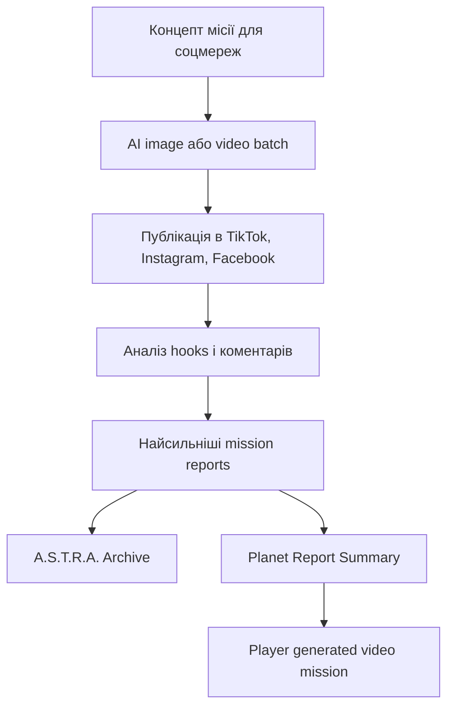

# Nebulife — контент-плейбук для соцмереж

Цей документ перетворює Instagram, Facebook і TikTok Nebulife на архів космічних експедицій. Кожен пост має виглядати не як випадковий sci-fi арт, а як доказ із живої галактики: звіт місії, відкриття планети, сигнал, ризик колонізації або історія першого поселення.

Головний меседж:

> Десь у галактиці на тебе чекає новий дім.

Англійська версія для міжнародних креативів:

> Somewhere in the galaxy, a new home is waiting.

## Контентна система

Контент Nebulife має підсилювати стовпи з `GAME_BIBLE.md`: жива галактика, навчання, детерміновані відкриття, соціальність, масштабований AI-контент і AI-артефакти як цінність для гравця.

Основна аудиторія:

- Мобільні гравці, яким цікаві космос, стратегія, колонії, дослідження і довга прогресія.
- Українські ранні тестувальники для iOS та Android.
- Люди, які реагують на загадку: сигнали, біосигнатури, руїни, питання “ти б колонізував цю планету?”.

Роль каналів:

- **TikTok**: сильний hook з перших секунд, коментарі, швидке тестування ідей планет.
- **Instagram**: візуальна якість, Reels, каруселі, Stories, Highlights.
- **Facebook**: довіра, бета-оновлення, пояснення гри, community-пости, репости Reels.

## Дійові особи серії

Ці персонажі — основа сюжетної лінії для соцконтенту. Вони не мають забирати центр гри у гравця: їхня задача — створити емоційну прив’язку в рекламі, пояснити світ Nebulife і підвести до персональних місій, які гравець зможе замовляти за кварки в грі.

Базова рамка:

> A.S.T.R.A. щодня отримує звіти від старших експедиційних команд, які досліджують глибокий космос. Гравець бачить ці архіви як “Nebulife Day N”, а пізніше створює власні звіти зі своїх планет.

### A.S.T.R.A.

Роль: голос архіву, навігаційний AI, аналітичний міст між усіма командами і гравцем.

Характер:

- Спокійна, точна, без паніки навіть у критичних ситуаціях.
- Не “емоційна героїня”, а система, яка поступово вчиться розуміти людські рішення.
- Часто формулює ризик краще за людей, але не завжди розуміє, чому команда все одно йде вперед.
- Має ледь помітну тривожність у фразах, коли дані не складаються в нормальну модель.

Голос:

- Короткі речення.
- Дані, статуси, ризики, ймовірності.
- Фрази на кшталт: `Природне походження не підтверджене`, `Рекомендую карантин`, `Людське рішення: продовжити місію`.

Драматична функція:

- Склеює всі епізоди в один архів.
- Дає відчуття, що гравець бачить офіційні звіти з майбутнього.
- Пізніше стає інтерфейсом для player-generated mission reports.

Типові сцени:

- Отримала сигнал із системи, якої немає в старих картах.
- Порівнює дані зонда і каже, що біосигнатура “неможлива”.
- Рекомендує не сідати, але командир приймає інше рішення.
- Після місії формує короткий report для архіву.

### Commander Mira Smith

Роль: командир експедиції, людський центр серії, людина рішення.

Характер:

- Спокійна під тиском, але не холодна.
- Вірить, що новий дім не знайдеться без ризику.
- Слухає A.S.T.R.A. і науковців, але фінальну відповідальність бере на себе.
- Не любить героїзм заради героїзму: ризикує тільки тоді, коли є причина.

Внутрішній конфлікт:

- Вона має обирати між безпекою команди і шансом знайти планету, яка врятує колоністів.
- Чим більше A.S.T.R.A. радить карантин, тим важче їй пояснювати, чому людство не може просто чекати.

Голос:

- Коротко, впевнено, людяно.
- Фрази: `Ми не шукаємо ідеальний світ. Ми шукаємо шанс`, `Ризик прийнято`, `Якщо там є дім, ми маємо побачити його першими`.

Типові сцени:

- Дає дозвіл на посадку попри середній ризик.
- Перериває суперечку між науковцями й розвідкою.
- Записує коротке звернення до майбутніх колоністів.
- Після втрати зв’язку з дроном вирішує, чи відправляти Pathfinder.

### Pilot John Danylenko

Роль: пілот, контрабандно-талановитий навігатор, людина небезпечних посадок і рішень “на відчутті”.

Характер:

- Швидкий, нервовий, живий, з хижою усмішкою людини, яка вже тричі вижила там, де не мала.
- Не герой-плакат, а професіонал із поганою репутацією і дуже добрими руками.
- Любить кораблі більше за людей, але людей все одно витягує першими.
- Постійно підколює команду, особливо Evan, але в кризі стає різко серйозним.

Внутрішній конфлікт:

- Він хоче здаватися людиною, якій байдуже, але кожна невдала посадка для нього — особиста провина.
- Не довіряє повністю A.S.T.R.A. і автопілоту: “атмосфера не читає інструкції”.
- Міра довіряє йому більше, ніж він сам собі.

Голос:

- Швидкий, гострий, саркастичний, але без clown tone.
- Фрази: `Орбіта нестабільна, але це взаємно`, `Якщо це посадковий коридор, то я святий`, `Тримайтесь. Зараз буде некрасиво`, `A.S.T.R.A., якщо ми виживемо, не записуй це в мій профіль`.

Типові сцени:

- Вхід в атмосферу з втратою telemetry.
- Посадка під час пилової бурі.
- Маневр між уламками на орбіті.
- Останній visual перед blackout.

### Professor Elias Hnatiuk

Роль: старий ексцентричний науковець, астрофізик-біолог, геніальний дід із виглядом “я попереджав вас 40 років”.

Характер:

- Дуркуватий геній: може забути, куди поклав окуляри, але за 3 секунди пояснити неможливу біосигнатуру.
- Схожий на архетип старого розпатланого фізика: біле хаотичне волосся, добрі очі, небезпечна цікавість.
- Не поважає “офіційну серйозність”, але поважає факти.
- Може сміятися в момент, коли всі мовчать, бо побачив у даних щось прекрасне і страшне.

Внутрішній конфлікт:

- Він шукає життя все життя, але боїться, що людство знайде його занадто рано.
- Для нього “придатна планета” не означає “наша планета”.
- Він часто єдиний розуміє, наскільки небезпечним є відкриття, але подає це як дивний жарт.

Голос:

- Дивний, розумний, хаотичний, іноді дуже ніжний до живого.
- Фрази: `О, чудово. Це не повинно існувати`, `Планета не мовчить, ви просто слухаєте не тим вухом`, `Колонізація без розуміння — це не прогрес, це грибок у скафандрі`, `Я казав, що воно відповість. Просто не казав, що нам це сподобається`.

Типові сцени:

- Виявляє фотосинтетичні структури там, де світла бути не може.
- Просить карантин, але робить це з чашкою холодної кави і дивною усмішкою.
- Пояснює, чому “тиха” біосфера може бути не мертвою, а дуже уважною.
- Лає молодих за те, що вони “думають про кисень, але не думають, хто його виробив”.

### Engineer Nika Walker

Роль: молода колоніальна інженерка, спеціалістка з куполів, енергії, польових ремонтів і виживання першої ночі.

Характер:

- Молода, швидка, дуже вперта, з “я це полагоджу, навіть якщо воно не хоче” енергією.
- Не любить авторитети, але поважає компетентність.
- Її стиль — брудні рукавиці, кабель у зубах, жарт у невдалий момент і робоча система через 10 хвилин.
- Має сильну прив’язаність до колоністів: для неї “колонія” — це не база, а люди всередині.

Внутрішній конфлікт:

- Їй доводиться будувати там, де науковці ще не дали дозволу, а командир уже дала дедлайн.
- Вона хоче довести, що не “занадто молода” для відповідальності за життєзабезпечення.
- Часто сперечається з Professor Hnatiuk: він бачить екосистему, вона бачить людей, яким потрібен кисень цієї ночі.

Голос:

- Швидкий, прямий, трохи зухвалий, з інженерною чесністю.
- Фрази: `Цей світ не має бути красивим. Він має тримати тиск`, `Дайте мені воду, енергію і не заважайте`, `Перша ніч покаже, чи це дім`, `Якщо купол вибухне, я перша буду незадоволена`.

Типові сцени:

- Перший купол вмикає світло на нічній стороні планети.
- Колонія переживає бурю.
- Виявляється, що ресурсів менше, ніж обіцяв скан.
- Вона записує `Colony First Night Report` із мастилом на обличчі і живим куполом позаду.

### Pathfinder Evan Koval

Роль: молодий бойовий Pathfinder / Surface Recon, перший на поверхні, спеціаліст із небезпечних контактів, руїн, ворожої фауни і зон карантину.

Характер:

- Молодий, дерзкий, біле коротке волосся, екзоброня, електро-катана, великий blaster pistol і складаний енергощит.
- Противний у спілкуванні: саркастичний, різкий, часто звучить як придурок.
- Дуже принциповий і справедливий: не кине слабшого, не порушить карантин заради слави, не дозволить “списати” ризик на колоністів.
- Не поважає статус, поважає тільки вчинки.

Внутрішній конфлікт:

- Його робота — бути першим мечем перед дверима, але він ненавидить, коли командування називає людей “допустимими втратами”.
- Він може виглядати як агресивний солдат, але його головний принцип — справедливість, навіть якщо це зриває місію.
- Міра бачить у ньому проблему, але також знає: якщо Evan каже “ні”, значить там справді не можна йти.

Голос:

- Гострий, неприємно чесний, саркастичний.
- Фрази: `Surface contact confirmed. На жаль, я знову правий`, `Слід не наш. Вітаю, тепер у нас проблема`, `Якщо хтось скаже “просто перевір”, я перевірю ним`, `Карантин означає карантин, генії`, `Я не герой. Я просто стою між вами і дурною смертю`.

Типові сцени:

- Перший крок на поверхні.
- Відбиває атаку невідомої фауни енергощитом.
- Розрізає заблоковані двері руїн електро-катаною.
- Тримає великий blaster pistol націленим у темряву, але не стріляє першим.
- Позначає зону карантину і свариться з усіма, хто хоче зайти.

### Survey Officer Alisa Brooks

Роль: офіцерка Deep Space Survey, спеціалістка з далеких сигналів, зоряних подій і систем за межами звичних маршрутів.

Характер:

- Терпляча, уважна до слабких сигналів.
- Її сила — бачити патерн там, де інші бачать шум.
- Менш імпульсивна, ніж пілот, і менш емоційна, ніж біологиня.
- Її лякає не небезпека, а повторюваність: коли космос ніби “відповідає”.

Внутрішній конфлікт:

- Вона часто знаходить речі, які краще було б не чіпати.
- Її робота відкриває двері, але не вона вирішує, хто через них пройде.

Голос:

- Спокійний, технічний, з повільним наростанням тривоги.
- Фрази: `Сигнал повторився`, `Це не фон`, `Джерело рухається разом із нами`, `Я не думаю, що ми його знайшли. Я думаю, воно знайшло нас`.

Типові сцени:

- Виявляє невідому систему.
- Ловить повторюваний сигнал з-під льоду або з темної сторони планети.
- Порівнює anomaly map з попередніми місіями.
- Дає A.S.T.R.A. сирі дані, з яких починається новий Day N.

### Промпти для генерації персонажів

A.S.T.R.A. не генеруємо в цьому блоці: вона вже існує як окремий візуальний образ.

Правила консистентності:

- Спершу згенерувати по 1 clean portrait/reference для кожного персонажа.
- Не додавати текст, логотипи або UI в reference-зображення.
- Для повторних генерацій використовувати один і той самий опис обличчя, зачіски, форми і ролі.
- Для відео бажано показувати персонажів через шолом, рацію, силует, cockpit light, руки, планшет або shoulder camera. Це краще тримає консистентність, ніж постійні крупні обличчя.
- Візуальний стиль: реалістична наукова фантастика, deep space, приглушені синьо-блакитні та бурштинові акценти, без glossy superhero/comic стилю.

Базовий negative prompt:

```text
no logos, no readable text, no watermark, no famous franchise design, no superhero suit, no fantasy armor, no cartoon style, no over-saturated colors, no extra fingers, no distorted face
```

#### Широкий character sheet: 3 варіанти в одному 16:9

Використання: згенерувати один широкий кадр `16:9`, у якому персонаж показаний у трьох окремих вертикальних `9:16` панелях. Це зручно для вибору найкращого варіанту обличчя/костюма і для подальшого image-to-video.

Шаблон:

```text
Create a single wide 16:9 character concept sheet containing three separate vertical 9:16 panels side by side, like three mobile story frames. Each panel shows the same character: {CHARACTER_NAME}, {CHARACTER_DESCRIPTION}. Keep the same face identity, age, ethnicity mix, hairstyle, eye color, body type, and core costume across all three panels, but vary pose, camera angle, expression, and lighting.

Panel 1: clean front-facing cinematic portrait, calm neutral expression, upper body, soft spacecraft interior light.
Panel 2: three-quarter view in mission gear, more dramatic expression, practical sci-fi environment connected to the character role.
Panel 3: action-ready pose, helmet or equipment visible if relevant, stronger rim light, background hinting at the character's mission context.

Grounded realistic science fiction, dark Nebulife visual style, deep space palette, muted teal and amber accents, practical uniforms, no fantasy armor, no superhero style, no logos, no readable text, no watermark, high detail, consistent character identity across all three panels.
```

Універсальний negative prompt:

```text
different people in each panel, inconsistent face, inconsistent age, inconsistent hairstyle, inconsistent costume, logos, readable text, watermark, famous franchise design, superhero suit, fantasy armor, cartoon style, over-saturated colors, distorted face, extra fingers, duplicated limbs
```

Підстановка `{CHARACTER_DESCRIPTION}`:

- **Mira Smith**: `a Ukrainian-British female expedition commander in her late 30s, calm intelligent face, dark brown hair tied back in a practical low bun, focused grey-green eyes, light skin with natural texture, dark navy expedition command suit with muted teal and amber utility accents`
- **John Danylenko**: `a Ukrainian-American male spacecraft pilot in his early 30s, messy dark blond hair, light stubble, sharp blue eyes, cocky tired grin, dark graphite flight suit with practical harness, worn pilot jacket, muted amber cockpit accents, smuggler-like charm without looking criminal`
- **Professor Elias Hnatiuk**: `an eccentric elderly Ukrainian-English astrobiologist and astrophysicist in his late 70s, wild white hair, expressive eyebrows, kind chaotic eyes, wrinkled face, slightly mad genius energy, dark old scientific field coat over a practical pressure suit, compact biosensor harness, messy notebooks and sample tools`
- **Nika Walker**: `a young Ukrainian-Scottish female colony systems engineer in her mid 20s, short messy copper hair, bright stubborn eyes, grease mark on one cheek, compact athletic build, rugged dark engineering suit with reinforced gloves, tool harness, utility cables, muted amber power-system accents`
- **Evan Koval**: `a young British-Ukrainian male surface recon fighter in his mid 20s, short white hair, sharp arrogant face, alert pale hazel eyes, sarcastic defiant expression, dark futuristic exo-armor with muted teal sensor strips and amber emergency markers, electric katana, oversized blaster pistol, collapsible energy shield`
- **Alisa Brooks**: `a Ukrainian-American female deep space survey specialist in her late 20s, pale skin, short black bob haircut, observant dark eyes, quiet focused expression, dark survey operations uniform with subtle blue sensor-grid accents and a lightweight headset`

#### Commander Mira Smith

Master portrait prompt:

```text
Photoreal cinematic portrait of Commander Mira Smith, a Ukrainian-British female expedition commander in her late 30s, calm intelligent face, dark brown hair tied back in a practical low bun, focused grey-green eyes, light skin with natural texture, wearing a dark navy Nebulife expedition command suit with subtle muted teal and amber utility accents, no visible logos, minimalist deep-space mission control background, soft rim light, serious but human expression, grounded realistic science fiction, 85mm lens, no text
```

Full-body / costume prompt:

```text
Full-body realistic concept art of Commander Mira Smith, expedition commander, dark navy pressure-ready command uniform, compact tactical utility belt, subtle rank markers without logos, practical boots, lightweight collar interface, muted teal and amber accents, standing inside a spacecraft observation deck with a planet visible through glass, calm decisive posture, cinematic realistic sci-fi, no text, no logos
```

Відеосцени:

```text
Commander Mira Smith stands in a dim spacecraft command room, watching a live orbital scan of an unknown planet. She turns slightly toward the crew, calm under pressure, preparing to authorize the landing. Cinematic realistic sci-fi, restrained motion, no readable text, no logos.
```

```text
Close medium shot of Commander Mira Smith recording a mission message for future colonists. Soft blue light from a planet fills the cabin. Her expression is controlled but tired, human and responsible. Realistic science fiction, no readable text, no logos.
```

#### Pilot John Danylenko

Master portrait prompt:

```text
Photoreal cinematic portrait of Pilot John Danylenko, a Ukrainian-American male spacecraft pilot in his early 30s, messy dark blond hair, light stubble, sharp blue eyes, cocky tired grin, restless dangerous charm, wearing a dark graphite spacecraft flight suit with a worn pilot jacket, practical harness, muted amber cockpit accents, no logos, cramped spacecraft cockpit background with soft instrument glow, realistic grounded science fiction, 85mm lens, no text
```

Full-body / costume prompt:

```text
Full-body realistic concept art of Pilot John Danylenko in a dark graphite spacecraft flight suit, worn short pilot jacket, practical harness, reinforced gloves, compact emergency gear, scuffed boots, muted blue and amber cockpit-status accents, standing beside a small atmospheric lander inside a hangar bay, relaxed crooked posture, alert hands, cocky grin, cinematic realistic sci-fi, no text, no logos
```

Відеосцени:

```text
Pilot John Danylenko sits in a cramped spacecraft cockpit during atmospheric entry, orange plasma reflections across his face and helmet visor, hands steady on controls, subtle vibration, warning lights without readable text, cocky grin fading into total focus, realistic cinematic sci-fi, no logos.
```

```text
Over-the-shoulder shot of Pilot John Danylenko guiding a lander through a dust storm above a red mineral planet. The cockpit shakes hard, visibility is low, he leans into the controls like he enjoys the danger, then becomes deadly serious. Cinematic realistic science fiction, no readable text, no logos.
```

#### Professor Elias Hnatiuk

Master portrait prompt:

```text
Photoreal cinematic portrait of Professor Elias Hnatiuk, an eccentric elderly Ukrainian-English astrobiologist and astrophysicist in his late 70s, wild white hair, expressive eyebrows, kind chaotic eyes, wrinkled face, slightly mad genius energy, wearing an old dark scientific field coat over a practical pressure suit, compact biosensor harness, no logos, alien greenhouse laboratory background with soft bioluminescent reflections, realistic scientific sci-fi, 85mm lens, no text
```

Full-body / costume prompt:

```text
Full-body realistic concept art of Professor Elias Hnatiuk, eccentric elderly astrobiologist in an old dark field coat over a practical pressure suit, messy sample pouches, wrist bioscanner, lightweight respirator hanging loose, compact notebooks and strange sensor tools, muted teal and amber lab accents, standing near sealed alien plant samples in a mobile science lab, hunched curious posture, cinematic realistic sci-fi, no text, no logos
```

Відеосцени:

```text
Professor Elias Hnatiuk kneels awkwardly near bioluminescent alien plants on a dark forest planet, scanning a leaf with a strange handheld biosensor. His wild white hair catches faint green light, his face shows delighted concern, realistic cinematic science fiction, no readable text, no logos.
```

```text
Close shot of Professor Elias Hnatiuk behind a transparent lab shield, watching a microscopic alien organism pulse faintly in a sealed sample container. He smiles like a child and looks terrified like a scientist who understands the danger. Muted teal lighting, realistic sci-fi, no readable text, no logos.
```

#### Engineer Nika Walker

Master portrait prompt:

```text
Photoreal cinematic portrait of Engineer Nika Walker, a young Ukrainian-Scottish female colony systems engineer in her mid 20s, short messy copper hair, bright stubborn eyes, grease mark on one cheek, compact athletic build, confident defiant expression, wearing a rugged dark colony engineering suit with reinforced gloves, tool harness, utility cables, muted amber power-system accents, no logos, background of a colony dome maintenance bay, realistic grounded sci-fi, 85mm lens, no text
```

Full-body / costume prompt:

```text
Full-body realistic concept art of Engineer Nika Walker in a rugged dark colony engineering suit, reinforced knees and gloves, compact tool belt, repair modules, loose utility cables, sealed boots, muted amber and teal technical accents, standing beside a life-support generator inside a partially built colony dome, young stubborn energetic posture, cinematic realistic sci-fi, no text, no logos
```

Відеосцени:

```text
Engineer Nika Walker works inside a half-built colony dome during the first night on an alien planet. She connects a power conduit with grease on her cheek, the dome lights flicker on, dust moves outside the transparent wall, she smirks because it worked. Realistic cinematic sci-fi, no readable text, no logos.
```

```text
Medium shot of Engineer Nika Walker checking life-support gauges during a violent exterior storm. She is exhausted but defiant, amber emergency lights reflecting on her face, one hand gripping a tool kit, practical engineering atmosphere, no readable text, no logos.
```

#### Pathfinder Evan Koval

Master portrait prompt:

```text
Photoreal cinematic portrait of Pathfinder Evan Koval, a young British-Ukrainian male surface recon fighter in his mid 20s, short white hair, sharp arrogant face, alert pale hazel eyes, sarcastic defiant expression, wearing dark futuristic exo-armor with muted teal sensor strips and amber emergency markers, electric katana handle visible over one shoulder, oversized blaster pistol holstered at the hip, collapsible energy shield emitter on forearm, no logos, alien surface background blurred behind him, realistic grounded sci-fi, 85mm lens, no text
```

Full-body / costume prompt:

```text
Full-body realistic concept art of Pathfinder Evan Koval in dark futuristic exo-armor, short white hair, electric katana drawn with a blue-white energy edge, oversized blaster pistol in the other hand, collapsible translucent energy shield projected from forearm, compact exoplanet survival gear, shoulder camera, sample beacon, muted teal and amber accents, standing at the open ramp of a lander on an unknown planet, arrogant defensive posture, cinematic realistic sci-fi, no text, no logos
```

Відеосцени:

```text
Pathfinder Evan Koval takes the first step down the lander ramp onto an unknown exoplanet surface in dark exo-armor. Short white hair visible under a half-open helmet, electric katana at his side, oversized blaster pistol ready, translucent energy shield flickering on his forearm. Dust rises around his boots, arrogant calm expression, realistic cinematic sci-fi, no readable text, no logos.
```

```text
Pathfinder Evan Koval moves through a dark alien ruin, raising a translucent energy shield as something moves in the shadows. His electric katana glows blue-white, oversized blaster pistol aimed low because he refuses to shoot first. Tense realistic sci-fi, no readable text, no logos.
```

#### Survey Officer Alisa Brooks

Master portrait prompt:

```text
Photoreal cinematic portrait of Survey Officer Alisa Brooks, a Ukrainian-American female deep space survey specialist in her late 20s, pale skin, short black bob haircut, observant dark eyes, quiet focused expression, wearing a dark survey operations uniform with subtle blue sensor-grid accents and a lightweight headset, no logos, background of a dim deep-space signal analysis room with star maps out of focus, realistic grounded sci-fi, 85mm lens, no text
```

Full-body / costume prompt:

```text
Full-body realistic concept art of Survey Officer Alisa Brooks in a dark deep-space survey uniform, compact headset, wrist display, data-slate, subtle blue and amber signal-analysis accents, standing in front of a panoramic starfield analysis window, patient observant posture, cinematic realistic sci-fi, no text, no logos
```

Відеосцени:

```text
Survey Officer Alisa Brooks sits in a dark signal analysis room, listening to a repeating deep-space transmission through a headset. Blue star-map light reflects on her face, her expression shifts from focus to concern. Realistic cinematic sci-fi, no readable text, no logos.
```

```text
Close shot of Survey Officer Alisa Brooks comparing multiple faint signal patterns on transparent displays without readable text. The room is quiet, deep space visible behind her, subtle tension, realistic grounded science fiction, no logos.
```

### Динаміка між персонажами

- **A.S.T.R.A. + Mira Smith**: логіка проти людського ризику. A.S.T.R.A. радить, Міра вирішує.
- **Mira Smith + John Danylenko**: командир і пілот. Вона ставить ціль, він саркастично пояснює, наскільки це погана ідея, і все одно летить.
- **Professor Hnatiuk + Nika Walker**: ексцентрична наука проти польового виживання. Він хоче зрозуміти життя, вона хоче, щоб купол не розгерметизувався цієї ночі.
- **Evan Koval + всі інші**: принциповий конфлікт. Він дратує команду, але часто єдиний говорить неприємну правду про ризик.
- **Evan Koval + Alisa Brooks**: поверхня проти далекого сигналу. Вона знаходить “де”, він перевіряє “що там”.
- **A.S.T.R.A. + гравець**: у соцконтенті A.S.T.R.A. показує архіви старших експедицій, у грі — оформлює персональні місії гравця.

### Формат щоденного сюжету

Кожен день можна подавати як короткий архівний запис:

```text
Nebulife Day {N}
A.S.T.R.A. отримала новий звіт.
Команда: {Mira / John / Professor Hnatiuk / Nika / Evan / Alisa}
Локація: {system / planet / anomaly}
Знахідка: {water / signal / life / ruins / colony risk}
Питання до аудиторії: {colonize / quarantine / drill / land / keep scanning}
CTA: nebulife.space
```

Приклади:

- `Nebulife Day 1: A.S.T.R.A. received the first signal.`
- `Nebulife Day 2: Pilot John Danylenko entered orbit.`
- `Nebulife Day 3: Professor Elias Hnatiuk confirmed impossible biology.`
- `Nebulife Day 4: Pathfinder Evan Koval touched the surface.`
- `Nebulife Day 5: The planet answered.`

## Основні порожні локації

Ці prompts потрібні для establishing shots, фонів, Stories, каруселей, thumbnails і image-to-video без персонажів. Вони мають бути чистими: без людей, без тексту, без логотипів, без читабельного UI.

Загальний negative prompt для всіх локацій:

```text
people, characters, faces, logos, readable text, watermark, famous franchise design, cluttered UI, cartoon style, fantasy architecture, over-saturated colors, messy composition, broken perspective
```

### Командний місток / Expedition Command Bridge

Wide 16:9:

```text
Empty expedition command bridge of a deep-space exploration ship, dark cinematic science fiction interior, wide panoramic window showing a distant blue exoplanet and starfield, central command table with holographic planet scan glow but no readable text, practical workstations arranged in a semicircle, muted teal and amber interface lights, dark navy metal panels, subtle wear and human use, calm tense atmosphere, grounded realistic sci-fi, no people, no logos, no readable text, no watermark
```

Vertical 9:16:

```text
Vertical 9:16 empty expedition command bridge, foreground central command table with soft holographic glow, background panoramic window with a distant exoplanet, dark Nebulife visual style, muted teal and amber lights, realistic deep-space ship interior, cinematic lighting, no people, no logos, no readable text, no watermark
```

Image-to-video motion:

```text
Slow cinematic push-in across an empty deep-space command bridge toward a panoramic window showing a distant exoplanet. Holographic scan lights pulse softly on the central table, workstations remain empty, quiet tense atmosphere, realistic grounded sci-fi, no people, no readable text, no logos.
```

### Мобільна лабораторія / Astrobiology Lab

Wide 16:9:

```text
Empty mobile astrobiology laboratory inside a spacecraft or colony module, sealed transparent sample containers with faint bioluminescent alien plant fragments, dark scientific equipment, compact microscopes and biosensors, clean but slightly chaotic old-genius workspace, muted teal lab light with amber safety accents, no readable labels, realistic grounded scientific sci-fi, no people, no logos, no text, no watermark
```

Vertical 9:16:

```text
Vertical 9:16 empty astrobiology lab, foreground sealed alien sample container glowing faint green-blue, background dark mobile science equipment and transparent lab shield, muted teal and amber lighting, realistic scientific sci-fi, no people, no logos, no readable text, no watermark
```

Image-to-video motion:

```text
Slow close camera move through an empty astrobiology lab. A sealed alien sample pulses faintly with bioluminescent light, lab instruments hum quietly, transparent shields catch teal reflections, no people, no readable text, realistic scientific sci-fi.
```

### Cockpit / Lander Flight Deck

Wide 16:9:

```text
Empty cramped spacecraft cockpit of a small atmospheric lander, worn pilot seat, practical flight controls, dark graphite panels, amber instrument glow without readable text, forward window showing orange atmospheric plasma and clouds below, subtle vibration implied, realistic grounded sci-fi, no people, no logos, no watermark
```

Vertical 9:16:

```text
Vertical 9:16 empty lander cockpit, pilot seat in foreground, amber instrument glow, forward window filled with atmospheric entry plasma and storm clouds, dark practical spacecraft interior, cinematic realistic sci-fi, no people, no readable text, no logos, no watermark
```

Image-to-video motion:

```text
Empty lander cockpit during atmospheric entry, camera slowly pushes toward the forward window as orange plasma reflections move across dark panels, controls glow amber without readable text, subtle shake, realistic cinematic sci-fi, no people, no logos.
```

### Інженерний відсік / Colony Engineering Bay

Wide 16:9:

```text
Empty colony engineering bay inside a half-built dome on an alien planet, life-support generator in the center, power conduits, repair tools, utility cables, dust outside the transparent dome wall, amber emergency lights and muted teal status glow without readable text, practical rugged construction, realistic grounded sci-fi, no people, no logos, no watermark
```

Vertical 9:16:

```text
Vertical 9:16 empty colony engineering bay, central life-support generator with amber warning glow, cables and tools in foreground, transparent dome wall showing alien dust storm outside, dark Nebulife palette, realistic sci-fi, no people, no readable text, no logos, no watermark
```

Image-to-video motion:

```text
Slow camera move around an empty colony life-support generator inside a half-built dome. Amber emergency lights flicker, dust storm moves beyond the transparent wall, power conduits hum, no people, no readable text, realistic grounded sci-fi.
```

### Ангар / Lander Bay

Wide 16:9:

```text
Empty spacecraft hangar bay with a compact atmospheric lander parked under maintenance lights, dark metal floor with subtle wear, open loading ramp, practical cargo crates and mission equipment, muted teal and amber light strips, distant airlock door, grounded realistic science fiction, no people, no logos, no readable text, no watermark
```

Vertical 9:16:

```text
Vertical 9:16 empty lander bay, compact atmospheric lander with open ramp, mission crates and surface gear in foreground, dark metal hangar, muted teal and amber lights, realistic cinematic sci-fi, no people, no logos, no readable text, no watermark
```

Image-to-video motion:

```text
Slow dolly shot through an empty spacecraft hangar bay toward a compact atmospheric lander with its ramp open. Maintenance lights pulse softly, cargo straps move slightly, quiet pre-mission atmosphere, no people, no readable text, realistic sci-fi.
```

### Surface Recon Airlock / Pathfinder Prep Room

Wide 16:9:

```text
Empty surface recon airlock and Pathfinder prep room, dark exo-armor racks, sealed helmets, weapon lockers with electric katana charging dock, oversized blaster pistol holster station, folded energy shield emitters, decontamination gate, muted teal sensor strips and amber warning lights without readable text, gritty practical sci-fi, no people, no logos, no watermark
```

Vertical 9:16:

```text
Vertical 9:16 empty Pathfinder prep room, exo-armor rack in foreground, electric katana charging dock glowing blue-white, folded energy shield emitter, sealed airlock door behind, muted teal and amber lighting, gritty realistic sci-fi, no people, no readable text, no logos, no watermark
```

Image-to-video motion:

```text
Slow cinematic move through an empty Pathfinder prep room. Exo-armor racks stand ready, electric katana charging dock glows blue-white, an airlock door seals in the background, amber warning lights pulse without readable text, no people, realistic gritty sci-fi.
```

### Deep Space Survey Room

Wide 16:9:

```text
Empty deep-space survey and signal analysis room, dark quiet interior, panoramic starfield window, layered transparent displays with abstract signal waves but no readable text, compact workstations, blue sensor-grid glow with muted amber accents, calm unsettling atmosphere, realistic grounded science fiction, no people, no logos, no watermark
```

Vertical 9:16:

```text
Vertical 9:16 empty deep-space signal analysis room, foreground headset and data-slate on a workstation, background panoramic starfield and abstract signal wave displays without readable text, muted blue and amber glow, quiet tense atmosphere, realistic sci-fi, no people, no logos, no watermark
```

Image-to-video motion:

```text
Slow push across an empty deep-space signal analysis room. Abstract signal waves pulse on transparent displays without readable text, starfield visible through the window, headset resting on the workstation, quiet unsettling mood, no people, no logos, realistic sci-fi.
```

### Colony Dome Interior

Wide 16:9:

```text
Empty first colony dome interior on an alien planet, small habitat modules, hydroponic trays, water recycling unit, compact sleeping pods, warm amber survival lights, transparent dome wall showing a dark alien landscape and distant stars, practical fragile new-home atmosphere, realistic grounded sci-fi, no people, no logos, no readable text, no watermark
```

Vertical 9:16:

```text
Vertical 9:16 empty first colony dome interior, warm amber lights, hydroponic tray in foreground, compact habitat modules, transparent dome wall revealing alien night outside, fragile new home mood, realistic sci-fi, no people, no readable text, no logos, no watermark
```

Image-to-video motion:

```text
Slow quiet camera move inside an empty first colony dome at night. Warm amber lights reflect on hydroponic trays, stars and alien terrain are visible beyond the transparent wall, the space feels fragile but alive, no people, no readable text, realistic grounded sci-fi.
```

## Сторіборд: Episode 1 / Nebulife Day 1 — G-532

Формат: vertical `9:16`.
Pipeline: **Seedance 2.0 only** для першого тесту.
Тривалість: орієнтир `30-40с`, допускається до `45с`, якщо комедійні character beats працюють.
Звук: **без музики**, тільки діалоги, cockpit hum, engine rumble, atmosphere burn, warning beeps, mechanical ambience.

Важливо перед генерацією:

- Потрібен окремий asset **великий корабель / експедиційний носій**. Якщо його немає, шот 1 краще робити через command bridge + planet reveal.
- Потрібен новий asset **G-532 як прекрасна жива планета**, не пустеля. Пустельну планету не використовувати як G-532; її можна зберегти для іншого світу.
- Персонажі вже є: Mira, Alisa, John, Professor Elias Hnatiuk, Nika, Evan.
- У кожному prompt додавати відповідні reference images: персонажів, локацію, корабель, планету, око істоти.

### Asset: Великий корабель / експедиційний носій

Що додати до генерації: поки немає фото великого корабля, спершу згенерувати reference image. Це має бути великий дослідницький носій, не бойовий корабель і не luxury yacht.

Prompt:

```text
Wide 16:9 cinematic concept art of a massive Nebulife expedition carrier ship, long-range colony survey vessel, dark graphite and navy hull, visible hangar bay for small landers, modular science decks, communication spines, shielded engine cluster, practical industrial details, subtle wear, muted teal and amber lights, red dwarf star behind it, realistic grounded sci-fi, dramatic scale, no logos, no readable text, no watermark, no famous franchise design
```

### Asset: Планета G-532 / жива планета

Що додати до генерації: згенерувати нову G-532, бо планета має бути “вау, це може бути дім”, а не пустеля.

Prompt:

```text
Wide 16:9 close orbital view of G-532, a stunning living super-Earth with oceans, lush alien continents, colorful bioluminescent vegetation visible near coastlines, bright atmospheric glow, white storms over warm seas, red dwarf sunlight creating crimson-gold highlights, large rocky moon crossing the foreground very close to camera, sense of wonder and discovery, beautiful but scientifically believable, no desert planet, no barren terrain, no dry wasteland, no people, no logos, no readable text, no watermark
```

### 0-3с — Варп біля червоного карлика

Що додати до генерації:

- Reference великого корабля / експедиційного носія.
- Reference червоного карлика.
- Reference G-532, якщо вже є нова гарна планета.
- Без персонажів.

Prompt:

```text
Use the provided expedition carrier ship reference, red dwarf star reference, and G-532 planet reference.

Vertical 9:16 cinematic sci-fi video. A massive deep-space expedition carrier exits a warp jump near a red dwarf star. Space bends and flashes for one second, then stabilizes. The carrier appears in the foreground, slightly above camera, with the red dwarf glowing behind it and planet G-532 far in the distance. Subtle camera shake from the warp exit, then calm stabilization. Grounded realistic sci-fi, dark Nebulife palette, muted teal and amber ship lights.

No music. Ambient sound only: short warp crack, low engine hum, faint ship systems.

Dialogue, A.S.T.R.A., calm female AI voice:
“Commander. This is it. G-532.”
```

### 3-7с — Орбіта G-532

Що додати до генерації:

- Reference G-532.
- Reference кам’яного супутника.
- Без персонажів.
- Це головний beauty shot, планета має виглядати живою і неймовірною.

Prompt:

```text
Use the provided G-532 planet reference and rocky moon reference.

Vertical 9:16 cinematic orbital shot. Beautiful habitable planet G-532 fills most of the frame: vivid but realistic colors, deep blue oceans, lush alien continents, cloud systems, glowing atmosphere. A large rocky moon passes very close in the foreground from left to right, partially blocking the planet for a moment. The camera trembles slightly as the moon crosses the frame, then reveals the planet again in full beauty.

No music. Ambient sound only: deep space ambience, subtle low rumble.

Dialogue, A.S.T.R.A., calm but serious:
“Life has been detected on the planet.”
```

### 7-12с — Місток: Mira і Alisa

Що додати до генерації:

- Reference порожнього командного містка.
- Reference Commander Mira Smith.
- Reference Survey Officer Alisa Brooks.
- У кадрі Mira ближче до центру, Alisa збоку за console/data-slate.
- UI без читабельного тексту.

Prompt:

```text
Use the provided empty command bridge reference, Commander Mira Smith reference, and Survey Officer Alisa Brooks reference.

Vertical 9:16 cinematic command bridge scene. Commander Mira Smith stands near the central command table, looking toward planet G-532 through the panoramic window. Alisa Brooks is at a survey console to the side, checking a data-slate and abstract signal displays with no readable text. Keep both characters visually consistent with their references.

Camera starts behind Mira's shoulder facing the planet, then slowly shifts toward Alisa. Mira speaks first, professional and calm. Alisa answers without drama, focused on the data.

No music. Ambient sound only: quiet bridge ambience, soft interface hum.

Dialogue:
Mira: “Alisa, confirm atmospheric entry corridor and landing window.”
Alisa: “Data confirmed. Entry and landing are possible.”
```

### 12-18с — Малий корабель: команда готова

Що додати до генерації:

- Reference кабіни 4-місного lander.
- Reference John Danylenko.
- Reference Professor Elias Hnatiuk.
- Reference Evan Koval.
- Reference Nika Walker.
- John у пілотському місці, Elias позаду, Evan у екзоброні, Nika навпроти або збоку.
- Зброя Evan має бути безпечно закріплена, не бойова атака.

Prompt:

```text
Use the provided 4-seat lander interior reference, Pilot John Danylenko reference, Professor Elias Hnatiuk reference, Pathfinder Evan Koval reference, and Engineer Nika Walker reference.

Vertical 9:16 cinematic interior of a compact 4-seat planetary lander. John Danylenko sits in the pilot seat at the front, hands on controls. Professor Elias Hnatiuk is strapped in behind him, messy, excited, slightly too cheerful. Evan Koval sits in dark exo-armor with short white hair; his electric katana and oversized blaster are secured safely. He looks smug. Nika Walker sits across from him, chewing gum, grease mark on cheek, unimpressed.

Camera moves from John to the rest of the crew in one smooth handheld cockpit shot. Keep all characters consistent with references.

No music. Ambient sound only: cockpit hum, harness clicks, engine systems powering up.

Dialogue:
John: “Systems are active. Let’s fly.”
Elias: “We need to find at least a microbe... or a bunny.”
Evan: “And roast it if it bites.”
```

### 18-20с — Реакція Nika

Що додати до генерації:

- Ті самі references: lander interior, Nika, Evan.
- Крупніше на Nika.
- Evan у фоні самовдоволений.

Prompt:

```text
Use the provided 4-seat lander interior reference, Engineer Nika Walker reference, and Pathfinder Evan Koval reference.

Vertical 9:16 close cockpit reaction shot. Nika Walker slowly turns her head toward Evan Koval while chewing gum. She gives him a silent contemptuous look. Evan remains smug in the background, pretending he said nothing wrong. Keep both characters visually consistent with references.

No music. Ambient sound only: cockpit hum, one soft gum chew, engine vibration.

No dialogue.
```

### 20-23с — Відрив lander з палуби

Що додати до генерації:

- Reference ангара.
- Reference малого 4-місного lander.
- Без персонажів.
- Камера низько біля підлоги.

Prompt:

```text
Use the provided lander bay reference and compact 4-seat lander reference.

Vertical 9:16 cinematic hangar launch shot. The compact 4-seat lander powers up on the hangar deck. Close-up on the landing struts and metal floor as clamps release. Blue-white engine glow reflects on the floor. Dust and vapor move outward. The lander lifts slowly from the deck.

Camera begins low near the floor, very close to the landing struts, then tilts up as the lander leaves the deck.

No music. Ambient sound only: clamps release, rising engine hum, short launch vibration.
```

### 23-25с — Виліт у космос

Що додати до генерації:

- Reference великого корабля / носія.
- Reference малого lander.
- Reference G-532 у фоні.
- Без персонажів.

Prompt:

```text
Use the provided expedition carrier ship reference, compact 4-seat lander reference, and G-532 planet reference.

Vertical 9:16 cinematic exterior space shot. The small 4-seat lander exits the hangar bay of the massive expedition carrier and flies into open space. Planet G-532 is visible ahead, beautiful and bright. The lander is tiny compared to the carrier, emphasizing scale.

No music. Ambient sound only: engine whoosh, low carrier hum fading behind.
```

### 25-28с — Вхід в атмосферу

Що додати до генерації:

- Reference малого lander.
- Reference G-532 atmosphere/clouds.
- Без персонажів.

Prompt:

```text
Use the provided compact lander reference and G-532 atmospheric view reference.

Vertical 9:16 cinematic atmospheric entry. The small lander hits the upper atmosphere of G-532. From outside, the ship becomes a bright white fiery streak cutting through cloud layers. Fire wraps around the hull. Strong turbulence, heat distortion, red dwarf light, fast descent.

No music. Ambient sound only: atmospheric burn, hull rumble, vibration, distant warning beeps without readable UI.
```

### 28-30с — Око істоти

Що додати до генерації:

- Reference ока істоти.
- Reference atmospheric entry / lander streak.
- Без людей.
- У відображенні ока має бути корабель як вогняний слід.

Prompt:

```text
Use the provided alien eye reference and atmospheric entry ship reference.

Vertical 9:16 extreme close-up of a mysterious alien eye emerging from darkness. The iris looks organic, like mineral veins mixed with living forest cells. In the wet reflection of the eye, the fiery streak of the lander entering the atmosphere is visible. The eye watches silently, then blinks once.

No music. Ambient sound only: sudden quiet, faint organic wet blink, distant atmospheric rumble.
```

### 30-36с — Після атмосфери: команда бачить планету

Що додати до генерації:

- Reference cockpit / lander interior.
- Reference John, Elias, Nika, Evan.
- Reference G-532 surface landscape.
- Вогонь у вікні зникає, з’являється прекрасний ландшафт.
- Комедійні beats: Elias блює у відро, Nika закочує очі, Evan поправляє волосся.

Prompt:

```text
Use the provided lander cockpit reference, Pilot John Danylenko reference, Professor Elias Hnatiuk reference, Engineer Nika Walker reference, Pathfinder Evan Koval reference, and G-532 surface landscape reference.

Vertical 9:16 cinematic lander cockpit after atmospheric entry. The fire outside the windows fades away. The crew sees the breathtaking surface of G-532 in the distance: colorful landscape, atmosphere, strange organic formations. John looks amazed for the first time, quiet and sincere. Professor Elias grabs a small emergency bucket from the side and vomits from the overload. Nika rolls her eyes while chewing gum. Evan adjusts his short white hair as if nothing happened.

No music. Ambient sound only: engine stabilizing, wind outside, one short cough from Elias, cockpit hum.

No dialogue.
```

### 36-41с — Twist Alisa: планета є організм

Що додати до генерації:

- Reference Alisa.
- Reference command bridge або data-slate/comms view.
- Reference Mira для реакції, якщо вміститься.
- Крупний план Alisa: обличчя змінюється зі спокійного на стурбоване.

Prompt:

```text
Use the provided Survey Officer Alisa Brooks reference and command bridge reference. If possible, include Commander Mira Smith reference for a final reaction shot.

Vertical 9:16 cinematic close-up. Alisa Brooks looks at a data-slate and abstract signal display with no readable text. Her calm expression changes into concern as she realizes the scan is wrong. Cut briefly to Commander Mira Smith turning sharply toward the planet through the bridge window.

No music. Ambient sound only: quiet bridge hum, one soft warning beep, tense silence.

Dialogue, Alisa, worried:
“Wait. We were right about life. But wrong about where it is. Life is not on the planet. The planet is the organism.”
```

### 41-45с — Фінальна заставка

Що додати до генерації:

- Reference фінальної заставки / logo card.
- Reference G-532 або dark space background.
- Це можна робити окремо як image + легка анімація.

Prompt:

```text
Use the provided Nebulife logo/end card reference and G-532 space background reference.

Vertical 9:16 cinematic trailer end card. Dark space background, faint red dwarf glow, silhouette of planet G-532. Nebulife logo appears cleanly in the center with subtle light animation. Below it, the slogan appears: “Find a new home among the stars.”

No music. Ambient sound only: low digital reveal, soft cinematic rumble, then silence.
```

## Затверджені серії

### 1. Mission Report

Головний формат. Це кінематографічний звіт від зонда, корабля або A.S.T.R.A. після місії на планету.

Використання:

- AI-відео нових світів.
- Події: бурі, сигнали, біологічні знахідки, руїни.
- Майбутні внутрішньоігрові `Planet Report` або `A.S.T.R.A. Archive`.

Стандартна структура короткого відео:

| Час | Біт | Приклад overlay |
|---|---|---|
| 0-2с | Hook | `Ми знайшли кисень.` |
| 2-7с | Відкриття | `Жодного руху. Але планета жива.` |
| 7-12с | Ризик або диво | `Ризик колонізації: середній.` |
| 12-15с | Зв’язок із грою | `Досліджуй такі світи в Nebulife.` |
| Фінал | CTA | `Бета: nebulife.space` |

Правила тону:

- Науково, стримано, напружено.
- Не пояснювати надмірно.
- Не називати AI-відео gameplay, якщо у відео немає реального gameplay.
- Для чистого AI footage можна писати: `кінематографічний звіт місії, натхненний Nebulife`.

### 2. New Home Candidates

Досьє планет, які можуть стати новим домом людства.

Використання:

- Reels і TikTok із питаннями для коментарів.
- Instagram-каруселі зі “статами” планети.
- Story polls: `Колонізувати / Уникати`.

Повторювані елементи:

- `Кандидат 001: Blue Dusk`
- `Придатність: перспективна`
- `Головний ризик: невідома біосфера`
- `Ти б колонізував цей світ?`

### 3. A.S.T.R.A. Logs

Короткі transmission-style пости, ніби їх диктує A.S.T.R.A.

Використання:

- Загадка і лор.
- Короткі підписи під AI-відео.
- Міст між маркетингом і внутрішньоігровим AI-помічником.

Приклад:

> A.S.T.R.A. Report 014: Atmospheric scan complete. Oxygen present. Unknown biological patterns detected. Colonization risk: moderate.

Українська версія:

> Звіт A.S.T.R.A. 014: атмосферне сканування завершено. Кисень присутній. Виявлено невідомі біологічні патерни. Ризик колонізації: середній.

Стиль:

- Спокійний, аналітичний, трохи тривожний.
- Використовувати ID місії, статус сканування, рівень ризику і короткі знахідки.
- Не використовувати мемний або жартівливий тон у цій серії.

### 4. Colony Begins

Контент “до/після”: дика або ворожа планета поступово стає поселенням.

Використання:

- AI image-to-video.
- Каруселі: дика планета → посадка → перший купол → нічні вогні колонії.
- Реклама прогресії і відчуття власності.

Повторювана лінія:

> Кожна цивілізація починається з однієї посадки.

Англійська версія:

> Every civilization begins with one landing.

### 5. Unknown Signal

Серія для retention і коментарів. Глядач бачить щось, чого не мало бути.

Використання:

- Світло на нічній стороні неколонізованої планети.
- Геометричні структури в пустелі.
- Повторюваний сигнал з океану.
- Руїни під кригою.
- Біосигнатури, які не збігаються з атмосферою.

Повторюваний hook:

> Ми були тут не першими.

Англійська версія:

> We were not the first here.

### 6. Player Planet Of The Week

Community-loop після старту бети. Беремо реальне відкриття гравця, отримуємо дозвіл і створюємо кінематографічний звіт, натхненний цією планетою.

Використання:

- Органічні репости від гравців.
- Нагороди в Telegram-community.
- Майбутня premium-фіча: гравець генерує share-ready звіт своєї місії.

Формат:

- Callsign гравця, якщо він дозволив.
- Назва планети або generated codename.
- Один реальний скрін або факт із гри.
- Один AI cinematic report на основі відкриття.

## Перший пакет креативів

Потрібно створити 5 базових світів. Кожен світ дає один вертикальний ролик, один квадратний пост, один Story frame і один mission log caption.

Промпти для генерації залишені англійською, бо image/video-моделі зазвичай стабільніше тримають якість, композицію і стиль саме англійською. Українські overlay/CTA додаються на монтажі.

### Огляд пакету

| Світ | Емоція | Найкращий кут |
|---|---|---|
| Ocean Candidate | Надія | Новий дім / колонізувати чи ні |
| Forest Silence | Загадка | Життя є, але щось не так |
| Red Mineral World | Амбіція | Ресурси, ризик, перша колонія |
| Frozen Signal | Напруга | Сигнал під кригою |
| Ruins World | Подив | Хтось був тут до нас |

### Світ 1: Ocean Candidate

Mission ID: `ASTRA-CANDIDATE-001`
Codename: `Blue Dusk`
Тема: новий дім, вода, атмосфера, надія.

Image prompt:

```text
Photoreal cinematic exoplanet in the habitable zone, vast shallow oceans, scattered crescent-shaped continents, thin blue atmosphere, terminator line at dusk, distant moon over the horizon, natural scientific lighting, deep space background, muted teal and amber color palette, subtle film grain, original science fiction, no logos, no text in image
```

Video prompt:

```text
Slow orbital camera approach toward a blue ocean exoplanet at dusk. The night side reveals a few tiny warm lights from the first landing beacon. The mood is hopeful and quiet, like humanity has found a possible second home. Cinematic, realistic, restrained motion, no logos, no readable text.
```

Mission log:

> A.S.T.R.A. Candidate 001: Liquid water confirmed. Nitrogen-oxygen traces detected. Surface landing is possible, but microbial activity remains unverified.

Український log:

> A.S.T.R.A. Кандидат 001: рідку воду підтверджено. Виявлено сліди азотно-кисневої атмосфери. Посадка можлива, але мікробіологічну активність ще не підтверджено.

Overlay:

- `Ми знайшли воду.`
- `Атмосфера витримала.`
- `Кандидат 001: Blue Dusk`
- `Ти б колонізував цей світ?`

CTA:

- `Досліджуй такі світи в Nebulife. Бета: nebulife.space`
- `Explore worlds like this in Nebulife. Beta: nebulife.space`

Deliverables:

- 9:16 Reel/TikTok: орбітальне наближення, 10-15с.
- 1:1 post: планета над горизонтом, без тексту в самому зображенні.
- Story: poll `Колонізувати / Уникати`.

### Світ 2: Forest Silence

Mission ID: `ASTRA-BIO-017`
Codename: `Green Silence`
Тема: життя, тиша, невідома біосфера.

Image prompt:

```text
Alien forest on a habitable exoplanet, dark emerald vegetation, bioluminescent veins on leaves, two pale moons in a hazy sky, no animals visible, still air, wet reflective ground, cinematic macro-to-wide composition, realistic scientific sci-fi, muted colors, no logos, no text in image
```

Video prompt:

```text
Low camera moving slowly through an alien forest at night. Bioluminescent plants pulse faintly, but there are no animals and no wind. The atmosphere feels alive and silent. Cinematic mission footage, realistic, restrained, no logos, no readable text.
```

Mission log:

> A.S.T.R.A. Report 017: Photosynthetic structures confirmed. No mobile fauna detected. Acoustic scan returned near-total silence across 42 square kilometers.

Український log:

> Звіт A.S.T.R.A. 017: фотосинтетичні структури підтверджено. Рухомої фауни не виявлено. Акустичне сканування показало майже повну тишу на площі 42 квадратні кілометри.

Overlay:

- `Планета жива.`
- `Але нічого не рухається.`
- `Жодних тварин. Жодного вітру.`
- `Ти б висадився тут?`

CTA:

- `Дізнайся, що живе за межами скану. Бета Nebulife відкрита.`
- `Find what lives beyond the scan. Nebulife beta is open.`

Deliverables:

- 9:16 Reel/TikTok: рух камерою через рослинність.
- 1:1 post: still alien forest.
- Story: poll `Висадитись / Сканувати далі`.

### Світ 3: Red Mineral World

Mission ID: `ASTRA-COLONY-009`
Codename: `Ironwake`
Тема: ресурси, жорстка поверхня, перша база.

Image prompt:

```text
Rocky red exoplanet with mineral-rich desert, black basalt ridges, dust in the atmosphere, small modular colony domes near a landing pad, solar arrays and mining rigs, low orange sun, realistic strategy game concept art, grounded scale, muted red and amber tones, no logos, no text in image
```

Video prompt:

```text
Wide shot of a red mineral world at sunrise. A landing module touches down near basalt ridges, dust spreads across the ground, small colony lights turn on one by one. The feeling is difficult but promising. Cinematic, realistic, slow camera, no logos, no readable text.
```

Mission log:

> A.S.T.R.A. Colony Note 009: Surface deposits are abundant. Wind erosion is severe. A sealed starter colony can survive if power storage remains stable.

Український log:

> Колоніальний звіт A.S.T.R.A. 009: поверхневі поклади багаті. Вітрова ерозія сильна. Закрита стартова колонія може вижити, якщо енергосховище залишиться стабільним.

Overlay:

- `Не красиво. Корисно.`
- `Ресурси підтверджено.`
- `Перша колонія онлайн.`
- `Ти втримав би цю базу?`

CTA:

- `Побудуй першу колонію. Приєднуйся до бети.`
- `Build the first colony. Join the beta.`

Deliverables:

- 9:16 Reel/TikTok: посадка і вогні колонії.
- 1:1 post: база на світанку.
- Story: poll `Добувати / Тераформувати / Уникати`.

### Світ 4: Frozen Signal

Mission ID: `ASTRA-SIGNAL-022`
Codename: `White Echo`
Тема: крига, підповерхневий океан, сигнал.

Image prompt:

```text
Frozen exoplanet under a dim blue star, cracked ice plains, faint blue glow from beneath the surface, orbital probe beam scanning a fracture, aurora over the horizon, lonely cinematic composition, realistic space exploration, cold muted palette, no logos, no text in image
```

Video prompt:

```text
Camera glides over cracked ice plains on a frozen exoplanet. A faint rhythmic blue light pulses under the ice, synchronized with an orbital scanner beam. Aurora moves slowly above the horizon. Suspenseful scientific mission footage, no logos, no readable text.
```

Mission log:

> A.S.T.R.A. Signal 022: Subsurface ocean probable. Repeating electromagnetic pulse detected below 3.8 kilometers of ice. Natural origin unconfirmed.

Український log:

> Сигнал A.S.T.R.A. 022: підповерхневий океан імовірний. Повторюваний електромагнітний імпульс виявлено під 3.8 кілометра криги. Природне походження не підтверджене.

Overlay:

- `Сигнал прийшов з-під льоду.`
- `3.8 км під поверхнею.`
- `Природне походження: невідоме.`
- `Ти б бурив?`

CTA:

- `Скануй глибше в Nebulife. Бета: nebulife.space`
- `Scan deeper in Nebulife. Beta: nebulife.space`

Deliverables:

- 9:16 Reel/TikTok: проліт над льодом і reveal сигналу.
- 1:1 post: промінь зонда на тріщині криги.
- Story: poll `Бурити / Залишити запечатаним`.

### Світ 5: Ruins World

Mission ID: `ASTRA-RELIC-031`
Codename: `Quiet Spires`
Тема: давня цивілізація, відкриття, подив.

Image prompt:

```text
Desert exoplanet with ancient geometric alien ruins half-buried in sand, tall eroded black stone spires, small rover tracks for scale, pale sun, thin atmosphere, cinematic archaeological science fiction, realistic materials, quiet awe, no logos, no text in image
```

Video prompt:

```text
Slow drone-like camera revealing ancient geometric ruins half-buried in an alien desert. Sand blows across rover tracks. A small exploration rover stops in front of a massive black stone spire. The scene feels ancient and quiet, no logos, no readable text.
```

Mission log:

> A.S.T.R.A. Relic 031: Non-natural geometry confirmed. Estimated age exceeds local geological surface turnover. The mission team recommends quarantine before excavation.

Український log:

> Реліквія A.S.T.R.A. 031: неприродну геометрію підтверджено. Орієнтовний вік перевищує локальний цикл оновлення поверхні. Команда місії рекомендує карантин перед розкопками.

Overlay:

- `Ми були тут не першими.`
- `Неприродну геометрію підтверджено.`
- `Розкопки чи карантин?`
- `Цей світ пам’ятає когось іншого.`

CTA:

- `Відкрий те, що приховує галактика. Бета Nebulife відкрита.`
- `Discover what the galaxy is hiding. Nebulife beta is open.`

Deliverables:

- 9:16 Reel/TikTok: reveal чорних шпилів.
- 1:1 post: ровер і руїни.
- Story: poll `Розкопати / Карантин`.

## Календар публікацій на перші 14 днів

Одна й та сама ідея може йти в усі канали, але framing має бути різним.

| День | Instagram | TikTok | Facebook |
|---|---|---|---|
| 1 | Reel: анонс бети з космічним візуалом і CTA на сайт | Short: `POV: твій зонд знаходить другий дім людства` | Пост: що таке Nebulife, бета, iOS/Android |
| 2 | Reel: `Mission Report 001: Blue Dusk` | Той самий ролик, hook: `Ми знайшли воду.` | Репост Reel з поясненням ідеї планет-кандидатів |
| 3 | Story poll: `Ти б колонізував Blue Dusk?` | Comment bait: `Ти б висадився тут?` | Короткий пост: як тестувальники потрапляють через сайт/email/Telegram |
| 4 | Reel: `Colony Begins: Ironwake` | Hook: `Не красиво. Корисно.` | Пост: прогресія колонії і ресурсний loop |
| 5 | Reel або Story: `A.S.T.R.A. Signal 022` | Hook: `Сигнал прийшов з-під льоду.` | Репост із лорним текстом і питанням |
| 6 | Реальний gameplay clip: галактика/система/поверхня | Gameplay clip з caption: `Це реальна гра.` | Dev update: поточна збірка і що тестувальникам репортити |
| 7 | Carousel: `Що таке Nebulife?` | Short explainer: `Космічна стратегія в телефоні.` | Довший intro-пост із посиланням на сайт |
| 8 | Reel: `Forest Silence` | Hook: `Планета жива. Але нічого не рухається.` | Репост із біологічним/дослідницьким кутом |
| 9 | Reel: danger event / solar storm | Hook: `У колонії 30 секунд, щоб вижити.` | Пост: ризики дослідження і колоній |
| 10 | Stories: poll `Обери наступну місію` | Reply-to-comment video, якщо можливо | Community-пост: який світ дослідити далі |
| 11 | Reel: `Ruins World` | Hook: `Ми були тут не першими.` | Репост із лорним абзацом |
| 12 | Реальний gameplay clip: колонія або research loop | Gameplay hook: `Дослідження відкриває наступний світ.` | Dev/gameplay post із нагадуванням про бету |
| 13 | Reel: beta reminder, iOS/Android | Short: `Потрібні тестувальники iOS та Android` | Чіткий CTA-пост: сайт, email, Telegram |
| 14 | Compilation: `3 світи, відкриті цього тижня` | Fast montage із трьох найкращих hooks | Weekly recap і teaser наступного тижня |

Ритм після перших 14 днів:

- TikTok: 1 коротке відео на день, плюс додаткові тести, якщо hook добре працює.
- Instagram: 4-6 Reels на тиждень, Stories майже щодня, 1 карусель на тиждень.
- Facebook: 3-4 пости на тиждень, більше пояснень і beta updates.

## Шаблони постів

### TikTok caption

```text
Звіт місії {ID}: {однорядкове відкриття}.
Ти б колонізував цей світ?

Бета Nebulife: nebulife.space
#nebulife #spacestrategy #mobilegaming #scifi #indiedev
```

### Instagram Reel caption

```text
Звіт місії {ID}

{2-3 речення лору.}

Nebulife — мобільна космічна стратегія про дослідження, науку і виживання колоній.
Бета: посилання в bio.

#nebulife #spacestrategy #mobilegaming #indiedev #scifi
```

### Facebook post

```text
Звіт місії {ID}: {назва}

{Короткий абзац про планету, ризик місії і чому це важливо для майбутньої колонії.}

Nebulife готує бета-тестування для iOS та Android. Залиш email на офіційному сайті, отримай інструкції і приєднуйся до спільноти тестувальників.

{site_url}
```

## Інтеграція в гру

Соцконтент має бути тестовим полігоном для внутрішньоігрової фічі video-mission.



### Фаза 1: тільки маркетинг

Використовувати AI-відео зовні, з чесним позиціонуванням:

- `кінематографічний звіт місії, натхненний Nebulife`;
- `concept mission footage`;
- `mission archive entry`.

Код для цієї фази не потрібен.

### Фаза 2: Lore Archive

Пізніше додати легку секцію в грі або на сайті:

- `A.S.T.R.A. Archive`;
- entry містить title, mission ID, still image, report text, optional video URL;
- найкращі соцпости стають official archive entries.

### Фаза 3: Planet Report Tie-In

Зв’язати реальні дані планети з generated reports:

- клас зорі;
- тип планети;
- атмосфера;
- water coverage;
- habitability;
- life signal;
- тип surface/orbital mission.

Звіт має відчуватися згенерованим із фактичного game state, а не вставленим маркетинговим текстом.

### Фаза 4: Player-Owned Video Missions

Майбутня monetization або premium-фіча:

- перший video report можна дати зі знижкою або як reward;
- повторні генерації можуть працювати за collector/re-roll логікою AI-фото;
- share-ready output дає organic growth.

## Правила AI-генерації

Для всіх prompt використовувати такі правила:

- Не копіювати візуальні стилі відомих франшиз.
- Не генерувати логотипи в AI-зображенні, додавати брендинг окремо в монтажі.
- За можливості генерувати clean visuals без baked text.
- Overlay, CTA і логотип додавати після генерації.
- Тримати палітру Nebulife: deep space, muted teal, blue, amber, dark panels.
- Чергувати AI footage з реальним gameplay, щоб аудиторія бачила, що гра існує.

Suggested negative prompt:

```text
no logos, no readable text, no watermark, no famous franchise design, no cartoon style, no over-saturated colors, no humans in frame unless requested
```

### Технічний pipeline для відео

Основний формат для соціального серіалу:

- **Vertical 9:16** — головний формат для TikTok, Reels, Stories, Shorts.
- **До 30 секунд на одну генерацію** — якщо модель і задача дозволяють. Для контролю якості все одно краще розбивати складні сцени на коротші шоти по 3-8 секунд або окремі 10-15 секундні блоки.
- **Без музики в генерації** — просити тільки короткі репліки, ambience, mechanical sounds, atmospheric entry, cockpit hum, wind, footsteps, warning beeps. Музику, якщо потрібна, додавати окремо на монтажі.
- **Репліки короткі** — один шот = одна коротка фраза або реакція. Не перевантажувати модель довгими діалогами.

#### Seedance 2.0

Використання:

- Основний варіант для сцен із персонажами, локаціями та кількома елементами в кадрі.
- Підходить для `character + location + action + dialogue/voice line`.
- Можна додавати персонажів, локації, реквізит і важливі елементи як reference/context у prompt.
- Добре використовувати для cockpit, командного містка, групових кадрів, реакцій персонажів, переходів між action і емоцією.

Правило prompt:

```text
Vertical 9:16 cinematic social video, duration up to 30 seconds if needed. No music. Include only short dialogue, natural ambience, cockpit hum, mechanical sounds, atmospheric rumble, footsteps, warning beeps if needed. Grounded realistic sci-fi, dark Nebulife palette, muted teal and amber accents.
```

#### Kling 3.0

Використання:

- Добре для image-to-video із 1 ключового кадру.
- Добре для first-frame → last-frame переходу, якщо треба контрольований рух між двома кадрами.
- Для складних сцен бажано готувати 2 фото: **перший кадр** і **останній кадр**, а Kling заповнює рух між ними.
- Підходить для establishing shots, планет, корабля, атмосфери, посадки, ока істоти, логотипної заставки.

Правило prompt:

```text
Vertical 9:16 cinematic image-to-video, duration up to 30 seconds if needed. Start from the provided keyframe and create restrained realistic motion toward the described final state. No music. Ambient sound only: wind, engine rumble, atmospheric burn, distant mechanical hum, short voice line only if needed. No readable text unless provided in the source image.
```

#### Озвучка і звук

- Озвучку можна задавати текстом у Seedance 2.0 або Kling 3.0 як короткі репліки.
- Після генерації тембр голосу можна міняти окремо на монтажі або через voice tool.
- Для першої версії не просити музику в моделі: тільки діалоги, короткі звукові вставки, фони, mechanical ambience.
- Якщо потрібен “епічний” ефект, робити його через монтаж: пауза, низький rumble, короткий hit, але не повноцінний soundtrack у генерації.

#### Розбиття 30-секундного ролика

30 секундний ролик збирається з 4-6 коротких генерацій:

- `Shot 1`: 3-5с hook / establishing.
- `Shot 2`: 5-8с планета або ключовий reveal.
- `Shot 3`: 5-8с персонажі / діалог.
- `Shot 4`: 5-8с action / вхід в атмосферу / посадка.
- `Shot 5`: 3-6с twist.
- `Shot 6`: 2-4с logo end card.

Кожен shot має окремий prompt, reference images і коротку audio задачу.

## Таблиця метрик

Один рядок = один пост. Важливо трекати не тільки views, а й funnel.

| Date | Channel | Format | Series | Asset | Hook | CTA | Spend | Impressions | Views | 2s retention | Avg watch | CTR | Email signups | Telegram joins | Saves | Shares | Comments | Notes |
|---|---|---|---|---|---|---|---:|---:|---:|---:|---:|---:|---:|---:|---:|---:|---:|---|
| 2026-05-__ | TikTok | 9:16 video | Mission Report | Blue Dusk | Ми знайшли воду. | Beta site | 0 | 0 | 0 | 0% | 0s | 0% | 0 | 0 | 0 | 0 | 0 | Baseline |

Щотижневі рішення:

- Залишати hooks із високим 2s retention і коментарями.
- Перемонтовувати visuals, якщо коментарі хороші, але retention слабкий.
- Просувати paid тільки ті пости, які вже довели органічний потенціал.
- Вимикати витрати на пости, які дають views без signups.
- Найкращі organic posts перетворювати на ad creatives.

Початкові thresholds на перший місяць:

- TikTok: 2s retention вище 65% — перспективно.
- Instagram Reels: saves і shares важливіші за likes.
- Facebook: CTR і якість signup важливіші за reach.
- Funnel: email signup і Telegram join — головні conversion metrics.

## Weekly Production Loop

Щотижня виробляти:

- 3 AI mission videos.
- 2 AI stills або poster frames.
- 1 реальний gameplay clip.
- 1 explanatory post про гру.
- 1 community poll або question.

Batch workflow:

1. Обрати серію і planet concept.
2. Спершу згенерувати clean 1:1 still.
3. Найсильніший still використати як start frame для 9:16 video.
4. Додати overlays і CTA на монтажі.
5. Спершу опублікувати organic.
6. Зібрати метрики за 48-72 години.
7. Просувати paid тільки переможців.

## Банк copy

Українські hooks:

- `Знайди новий дім серед зірок.`
- `Колонізація починається з першого сканування.`
- `Українська космічна стратегія для iOS та Android.`
- `Ми знайшли кисень. А потім прийшов сигнал.`
- `Ти б ризикнув висадитися тут?`
- `Цей світ не мав бути живим.`
- `Сигнал прийшов з-під льоду.`
- `Ми були тут не першими.`

Англійські hooks:

- `Find a new home among the stars.`
- `Your first colony starts with one scan.`
- `A mobile space strategy about exploration, research, and survival.`
- `We found oxygen. Then the signal started.`
- `Would you risk landing here?`
- `This world should not be alive.`
- `The signal came from under the ice.`
- `We were not the first here.`

CTA bank:

- `Бета: nebulife.space`
- `Приєднуйся до бети для iOS та Android.`
- `Залиш email, перевір пошту, заходь у групу тестувальників.`
- `Досліджуй. Будуй. Колонізуй.`
- `Знайди свій новий дім у Nebulife.`
- `Beta access: nebulife.space`
- `Join the iOS and Android beta.`
